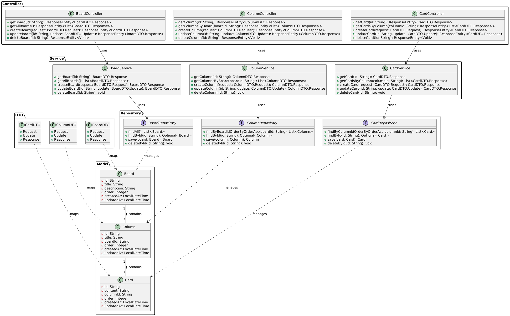

# MyTrello Project

A Trello-like task management application built with Spring Boot and React.

## Project Structure

```
mytrello/
├── backend/                      # Spring Boot backend
│   ├── src/
│   │   ├── main/
│   │   │   ├── java/
│   │   │   │   └── com/
│   │   │   │       └── mytrello/
│   │   │   │           ├── controller/    # REST controllers
│   │   │   │           ├── dto/           # Data Transfer Objects
│   │   │   │           ├── model/         # Domain models
│   │   │   │           ├── repository/    # Data access layer
│   │   │   │           ├── service/       # Business logic
│   │   │   │           └── MyTrelloApplication.java
│   │   │   └── resources/
│   │   │       └── application.properties # Application configuration
│   └── pom.xml                  # Maven dependencies
├── frontend/                    # React frontend
└── docker-compose.yml          # Docker configuration
```

## Architecture

The application follows a layered architecture pattern with clear separation of concerns:

### Backend Architecture



The UML diagram above shows the main components of the system:

1. **Model Layer**: Contains the domain entities
   - `Board`: Represents a Kanban board
   - `Column`: Represents a column within a board
   - `Card`: Represents a task card within a column

2. **DTO Layer**: Data Transfer Objects for request/response handling
   - Each entity has corresponding DTOs for:
     - Request: Input validation
     - Update: Partial updates
     - Response: API responses

3. **Repository Layer**: Data access interfaces
   - Extends MongoDB repositories
   - Provides custom query methods
   - Handles database operations

4. **Service Layer**: Business logic implementation
   - Implements business rules
   - Handles data transformation
   - Manages transactions

5. **Controller Layer**: REST API endpoints
   - Handles HTTP requests
   - Manages input validation
   - Returns appropriate HTTP responses

### Relationships
- A Board contains multiple Columns (1:N)
- A Column contains multiple Cards (1:N)
- Services use Repositories for data access
- Controllers use Services for business logic
- DTOs map to and from domain entities

## Technology Stack

### Backend
- Java 17
- Spring Boot 3.2.3
- Spring Data MongoDB
- Spring Validation
- Lombok
- Maven

### Frontend
- React
- Material-UI
- Axios

### Database
- MongoDB

## Setup and Running

### Prerequisites
- Java 17
- Maven
- Docker and Docker Compose
- Node.js and npm

### Running the Application

1. **Start the Database and Services**
```bash
docker-compose up -d
```

2. **Build and Run Backend**
```bash
cd backend
mvn clean install
mvn spring-boot:run
```
The backend will start on http://localhost:5000

3. **Build and Run Frontend**
```bash
cd frontend
npm install
npm start
```
The frontend will start on http://localhost:3000

## API Endpoints

### Columns

| Method | Endpoint | Description |
|--------|----------|-------------|
| GET | `/api/columns/{id}` | Get a column by ID |
| GET | `/api/columns/board/{boardId}` | Get all columns for a board |
| POST | `/api/columns` | Create a new column |
| PUT | `/api/columns/{id}` | Update a column |
| DELETE | `/api/columns/{id}` | Delete a column |

### Request/Response Examples

#### Create Column
```json
POST /api/columns
{
  "title": "To Do",
  "boardId": "board123",
  "order": 1
}
```

#### Update Column
```json
PUT /api/columns/{id}
{
  "title": "In Progress",
  "order": 2
}
```

## Configuration

### Backend Configuration (application.properties)
```properties
server.port=5000
spring.data.mongodb.host=mongodb
spring.data.mongodb.port=27017
spring.data.mongodb.database=mytrello
```

### Frontend Configuration
The frontend is configured to connect to the backend API at `http://localhost:5000/api`

## Development

### Adding New Features
1. Create the model class in `backend/src/main/java/com/mytrello/model`
2. Create DTOs in `backend/src/main/java/com/mytrello/dto`
3. Create the repository interface in `backend/src/main/java/com/mytrello/repository`
4. Implement the service layer in `backend/src/main/java/com/mytrello/service`
5. Create the controller in `backend/src/main/java/com/mytrello/controller`

### Code Style
- Use proper Java naming conventions
- Follow REST API best practices
- Implement proper validation and error handling
- Use DTOs for request/response handling
- Document new endpoints and features

## Error Handling
The application implements proper error handling:
- Validation errors return 400 Bad Request
- Not found errors return 404 Not Found
- Server errors return 500 Internal Server Error

## Security
- CORS is configured to allow requests from the frontend
- Input validation is implemented using Jakarta Validation
- Proper error messages are returned without exposing internal details 